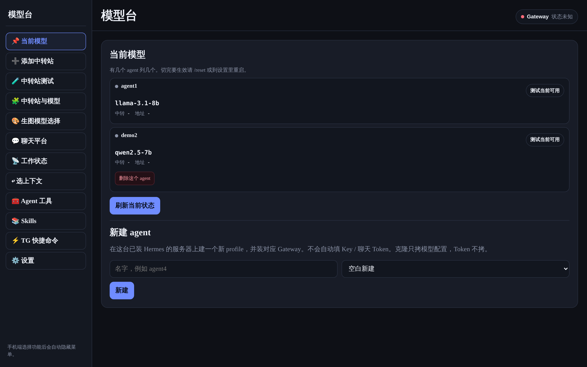
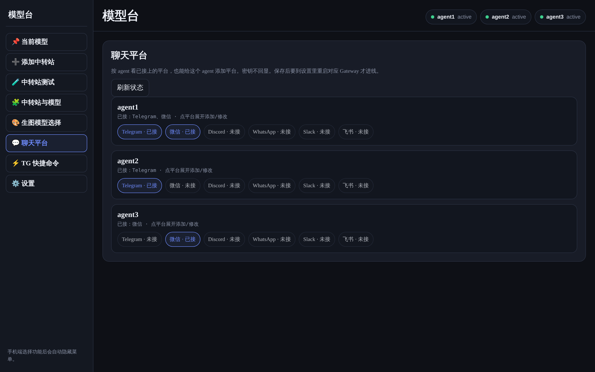
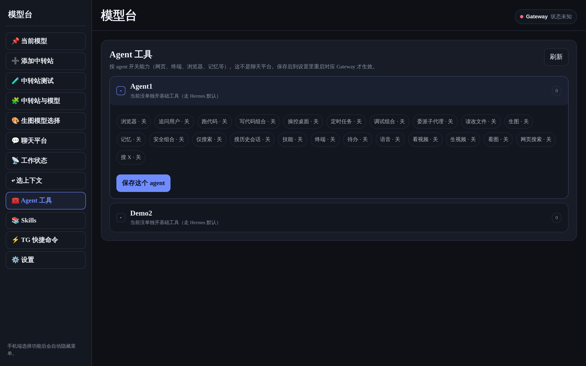

# Hermes Model Panel

[](https://github.com/17sho/hermes-model-panel/releases)
[](package.json)
[](LICENSE)
[](https://github.com/NousResearch/hermes-agent)

[中文](README.md) · **English**

A responsive web control panel for an existing [Hermes Agent](https://github.com/NousResearch/hermes-agent) installation. Manage models, OpenAI-compatible relays, Agent profiles, chat platforms, Skills, tools, sessions, and Gateway services from one UI.

> This panel does not install Hermes or provide API keys and bot tokens. Install and configure Hermes Agent first.



## Features

| Area                 | Capabilities                                                                                 |
| -------------------- | -------------------------------------------------------------------------------------------- |
| Models and relays    | Add compatible relays, fetch and test models, and authorize private-network access per relay |
| Agents / Profiles    | Create and remove Profiles with independent model and service settings                       |
| Chat platforms       | Manage Telegram, Weixin, Discord, WhatsApp, Slack, and Feishu                                |
| Tools and Skills     | Inspect and switch toolsets per Agent, manage Skills                                         |
| Sessions and context | Inspect work status, resume historical context, generate quick commands                      |
| Gateway              | Inspect status and raw logs; install, start, stop, or restart services                       |
| Security             | Server-side login, Session cookies, CSRF validation, atomic config writes                    |
| Online updates       | Check GitHub revisions, install in the background, automatically roll back failures          |
| Responsive UI        | Persistent desktop sidebar, mobile drawer, light and dark themes                             |

<p align="center">
  
  
</p>

## Quick installation

### Requirements

- Linux with systemd
- Hermes Agent already installed with `~/.hermes/config.yaml`
- Node.js 20+, npm, rsync, and OpenSSL
- root or sudo access

```bash
git clone https://github.com/17sho/hermes-model-panel.git
cd hermes-model-panel
sudo bash install.sh
```

The installer checks the Hermes configuration, installs the panel at `/opt/hermes-model-panel`, installs production dependencies, creates `/etc/hermes-model-panel.env` on first run, enables the systemd service, and prints the local URL.

The server listens on `127.0.0.1:3010` by default. For LAN access, explicitly use:

```bash
sudo HOST=0.0.0.0 AUTH_DISABLED=0 bash install.sh
sudo ufw allow from 192.168.0.0/16 to any port 3010 proto tcp
```

For public access, keep password authentication enabled and terminate HTTPS through Caddy or Nginx. Never expose a passwordless panel directly to the Internet.

## Manual run

```bash
npm ci
npm start
```

Production examples:

- [`samples/hermes-model-panel.env.example`](samples/hermes-model-panel.env.example)
- [`systemd/hermes-model-panel.service`](systemd/hermes-model-panel.service)
- [`caddy/hermes-model-panel.caddy.example`](caddy/hermes-model-panel.caddy.example)

## Online updates

After the initial v1.1.0 deployment, open **Settings → Panel online update** to check GitHub `main`. The updater pins the target commit SHA, installs dependencies and validates code in a temporary directory, replaces the program directory, and restarts the service. A failed startup restores the previous release.

Updates replace code only. They preserve the environment file, Hermes configuration and Profiles, Session databases, panel metadata, and credentials.

> The current updater targets GitHub commit SHAs. For public production systems, update only to reviewed stable revisions.

## Security notes

- The service listens on `127.0.0.1` by default.
- Public deployments require a strong administrator password and persistent `SESSION_SECRET`.
- Stored secrets are not echoed back in plaintext by the UI.
- Before writing Hermes YAML, the panel creates timestamped `.bak-*` files and retains the latest ten.
- The current systemd service remains root-compatible because Hermes configuration, Profiles, logs, and service controls need real permission testing before migration to a dedicated user.

Never commit real `.env` files, API keys, bot tokens, cookies, databases, or production configuration.

## Development and testing

```bash
npm ci
python3 -m pip install -r requirements-dev.txt
npm run check
npx playwright install chromium
npm run test:e2e
```

`npm run check` covers Node/Python syntax, ESLint, Stylelint, Ruff, Prettier, and `node:test`. Playwright runs against a read-only fixture server and cannot mutate production configuration.

## License

[MIT](LICENSE)

If this project helps you, a **Star** is appreciated. Issues and pull requests are welcome.
